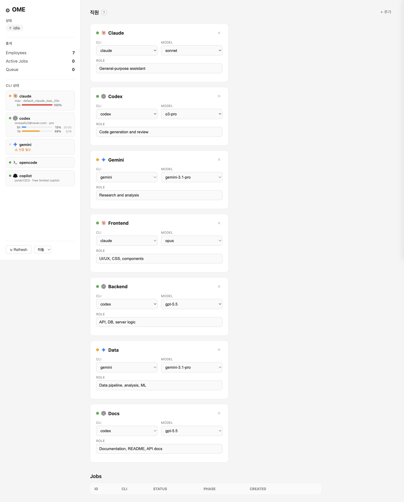

<p align="center">
  <strong>OME</strong><br>
  <em>Orchestrated Multi-agent Engine</em>
</p>

<p align="center">
  <a href="https://www.npmjs.com/package/ome"></a>
  <a href="https://nodejs.org"></a>
  <a href="LICENSE"></a>
  <a href="tsconfig.json"></a>
</p>

<p align="center">
  Spawn, dispatch, and orchestrate AI agent CLIs — Claude Code, Codex, Gemini CLI, Copilot, OpenCode — as <strong>employees</strong> from a single unified interface.
</p>

<p align="center">
  
</p>

---

## Features

| Feature | Description |
|---------|-------------|
| **Multi-CLI spawn** | Run any AI CLI (`claude`, `codex`, `gemini`, `copilot`, `opencode`, or any executable) with a single command |
| **Employee registry** | Register named employees with preset CLI, model, role, and system prompt |
| **Session resume** | Automatically resumes previous sessions per employee — stale sessions detected and retried |
| **Per-CLI quota** | Live quota display proxied from cli-jaw — per-window bars with account info and reset times |
| **Job tracking** | Every spawn creates a persistent job with ID, metadata, PID, and NDJSON event log |
| **Live observation** | Watch running jobs in real-time or inspect state snapshots cross-process |
| **Web dashboard** | Management UI with employee CRUD, prompt editor side panel, per-CLI quota cards, and job status |
| **Cross-platform kill** | Process tree termination via Unix process groups + Windows taskkill fallback |

---

## Quick Start

```bash
# Install
git clone https://github.com/lidge-jun/ome.git
cd ome && npm install && npm run build

# Link globally (optional)
npm link

# Seed default employees (Frontend, Backend, Data, Docs)
ome init

# Spawn a one-off agent
ome spawn --cli claude --model opus "Fix the login bug in auth.ts"

# Dispatch to a registered employee
ome dispatch --agent "Backend" --task "Review the PR and suggest improvements"

# Inspect the provider-specific spawn contract without running it
ome spawn --dry-run --cli codex "Review args only"

# Start the web dashboard
ome web    # → http://127.0.0.1:7700
```

### Requirements

- **Node.js >= 20**
- At least one AI CLI installed: `claude`, `codex`, or `gemini`
- SQLite via `better-sqlite3` (auto-compiled on install)

---

## Architecture

```
ome spawn / ome dispatch
  │
  ├── spawn/
  │   ├── index.ts ──→ spawn CLI process, session ID capture
  │   ├── args.ts ──→ per-CLI arg builders (new + resume)
  │   ├── preflight.ts ──→ CLI binary checks and path resolution
  │   ├── jobs.ts ──→ ~/.ome/jobs/{id}.meta.json + .ndjson
  │   └── process-kill.ts ──→ cross-platform SIGTERM / SIGKILL
  │
  ├── dispatch/
  │   └── index.ts ──→ employee lookup → session resume → stale retry
  │
  ├── registry/
  │   └── db.ts ──→ SQLite (employees, sessions, quota)
  │
  ├── observe/
  │   ├── parser.ts ──→ NDJSON → ProgressEvent (claude/codex/gemini)
  │   └── index.ts ──→ watch() polling + inspect() snapshot
  │
  └── web/
      ├── routes.ts ──→ REST API
      ├── dashboard.ts ──→ inline HTML/JS dashboard (XSS-safe)
      ├── dashboard-styles.ts ──→ CSS
      └── quota-proxy.ts ──→ per-CLI quota via cli-jaw proxy
```

---

## CLI Reference

### `ome spawn` — Direct Agent Invocation

```bash
ome spawn [--dry-run] --cli <name> [--model <model>] "<prompt>"
```

| Flag | Default | Description |
|------|---------|-------------|
| `--cli` | `claude` | CLI binary (`claude`, `codex`, `gemini`, `copilot`, or any executable) |
| `--model` | *(CLI default)* | Model override |
| `--dry-run` | `false` | Print the provider-specific args and prompt transport without spawning |

```bash
ome spawn --cli claude --model opus "Refactor the database module"
ome spawn --cli codex --model o3-pro "Add unit tests for auth"
ome spawn --cli gemini "Analyze quarterly sales data"
ome spawn --dry-run --cli codex "Inspect spawn contract"
ome spawn --cli python3 "print('hello')"   # any CLI works
```

### `ome dispatch` — Employee-Based Invocation

```bash
ome dispatch --agent "<name>" --task "<task>"
```

Finds the named employee, uses their configured CLI/model/prompt, and spawns the task. If a previous session exists for that employee (same CLI + model), it automatically resumes via `--resume`.

```bash
ome dispatch --agent "Frontend" --task "Fix CSS grid on mobile"
ome dispatch --agent "Backend" --task "Generate OpenAPI spec"
```

**Session resume** is automatic. If the resumed session is stale (conversation not found, expired, etc.), OME clears the session and retries with a fresh spawn.

Employee prompts are only passed to CLIs with a verified system-prompt contract. Unsupported providers fail clearly instead of silently dropping role instructions.

### `ome doctor` — CLI Preflight

```bash
ome doctor
```

Checks known agent CLI binaries (`claude`, `codex`, `gemini`, `copilot`, `opencode`) with a safe version probe and reports whether each executable is available.

### `ome registry` — Employee Management

```bash
ome registry add --name "<name>" --cli <cli> [--model <model>] [--role "<role>"]
ome registry remove "<name>"
ome registry list
```

```bash
ome registry add --name "Backend" --cli codex --model o3-pro --role "API and database"
ome registry add --name "Researcher" --cli gemini --role "Deep research"
ome registry list
ome registry remove "Backend"
```

Employee prompts can be edited from the web dashboard's side panel — click any employee name to open the prompt editor.

### `ome jobs` — Job Tracking

```bash
ome jobs                 # List recent jobs (max 30)
ome result <job-id>      # Full output of a completed job
ome kill <job-id>        # Kill a running job (cross-process, via PID)
```

Jobs are persisted under `~/.ome/jobs/`:
- `{id}.meta.json` — status, CLI, prompt, PID, timestamps
- `{id}.ndjson` — streaming event log

Old jobs are automatically pruned (max 50 non-running, LRU).

### `ome watch` / `ome inspect` — Live Monitoring

```bash
ome watch <job-id>       # Live event stream (file-tailing)
ome inspect <job-id>     # Current state snapshot
```

Cross-process safe — reads job files, not in-memory state. Watch from a separate terminal.

```
$ ome watch job-m1abc-x9f3
10:23:45 [assistant] Analyzing the codebase...
10:23:47 [tool_use:Read] Reading src/auth.ts
10:23:50 [assistant] Found the issue in line 42...
```

### `ome web` — Web Dashboard

```bash
ome web                          # http://127.0.0.1:7700
ome web --port 3500              # custom port
ome web --host 0.0.0.0           # bind all interfaces
```

Dashboard features:
- **Stats bar** — employee count, active jobs, queue depth
- **Per-CLI quota cards** — live bars with account info, reset times (proxied from cli-jaw)
- **Employee table** — add, remove, inline SVG provider icons per CLI
- **Prompt editor** — click any employee name to open a side panel for editing system prompts
- **Jobs table** — status badges, inspect button
- **Auto-refresh** — polls every 5 seconds

### `ome init` — Seed Defaults

```bash
ome init
```

Registers 4 default employees (idempotent):

| Name | CLI | Model | Role |
|------|-----|-------|------|
| Frontend | claude | opus | UI/UX, CSS, components |
| Backend | codex | gpt-5.5 | API, DB, server logic |
| Data | gemini | gemini-3.1-pro | Data pipeline, analysis, ML |
| Docs | codex | *(default)* | Documentation, README, API docs |

### `ome status`

Shows: agent busy state, active/total jobs, queue depth, employee list.

---

## Web Dashboard Details

### Per-CLI Quota

The dashboard proxies quota data from cli-jaw (`GET http://127.0.0.1:3457/api/quota`) with a 30-second cache. Each CLI gets its own card showing:

- Account info (email, plan/tier)
- Per-window quota bars (5h, 7d, monthly, etc.)
- Color-coded fill: green (< 80%), yellow (80–99%), red (100%)
- Reset time in compact format (HH:MM for today, M/D for future dates)

When cli-jaw is not running, quota shows as "unavailable."

### Employee Prompt Editor

Click any employee name to open a slide-in side panel. Edit the system prompt and save. OME passes prompts only to CLIs with a verified system-prompt contract; unsupported providers fail clearly instead of silently dropping employee instructions.

### Session Resume

OME tracks CLI sessions per employee in SQLite (`employee_sessions` table). On dispatch:

1. Check if a previous session exists for the employee (matching CLI + model)
2. If yes, spawn with resume args (e.g., `--resume <sessionId>` for Claude)
3. If the resume fails with a stale session error, clear and retry fresh
4. On success, persist the new session ID for future resumes

Supported CLIs for resume:

| CLI | Resume method |
|-----|--------------|
| Claude | `--resume <sessionId>` |
| Codex | `exec resume <sessionId> <prompt>` |
| Gemini | `--resume <sessionId>` |
| OpenCode | `-s <sessionId>` |

### Security

| Threat | Mitigation |
|--------|-----------|
| XSS | `textContent` only — never `innerHTML` for dynamic values |
| Path traversal | `isValidJobId()` regex guard on all job endpoints |
| Request smuggling | `Content-Type: application/json` required for POST/PUT |
| Body bombs | 1MB cap with `req.destroy()` on exceed |
| Slow-loris | `requestTimeout=30s`, `headersTimeout=10s` |
| Default bind | `127.0.0.1` only — `0.0.0.0` is opt-in via `--host` |

---

## Library API

OME can be used as a library in Node.js projects:

```typescript
import { spawnAgent, dispatch, initDb, seedDefaults } from 'ome';
import { inspect, watch } from 'ome/observe';

// Initialize
initDb('~/.ome/ome.db');
seedDefaults();

// Direct spawn
const { jobId, result } = spawnAgent('Fix the bug', {
    cli: 'claude',
    model: 'sonnet',
    systemPrompt: 'You are a senior engineer.',
    cwd: '/path/to/project',
});
console.log(`Job started: ${jobId}`);
const output = await result;
console.log(`Exit ${output.code}, session: ${output.sessionId}`);

// Employee dispatch (auto-resume)
const dr = await dispatch('Frontend', 'Fix CSS grid', {
    cwd: '/path/to/project',
});
console.log(`Job: ${dr.jobId}, session: ${dr.sessionId}`);

// Observe
const state = inspect(jobId);
for await (const event of watch(jobId)) {
    console.log(`[${event.type}] ${event.message}`);
}
```

### Package Exports

| Path | Description |
|------|-------------|
| `ome` | Main entry — spawn, dispatch, registry, types |
| `ome/observe` | Observation subpath — inspect, watch, parser |

### Key Types

```typescript
interface SpawnResult {
    text: string;          // stdout output
    code: number;          // exit code
    jobId?: string;        // job tracking ID
    sessionId?: string;    // CLI session ID (for resume)
    stderr?: string;       // stderr output
    durationMs?: number;   // wall-clock duration
}

interface SpawnOptions {
    cli?: AgentCli;
    model?: string;
    systemPrompt?: string;  // provider-specific; unsupported CLIs fail clearly
    sessionId?: string;     // resume a previous session
    cwd?: string;
    timeout?: number;
    env?: Record<string, string>;
    onStdout?: (chunk: string) => void;
    onStderr?: (chunk: string) => void;
}

type AgentCli = 'claude' | 'codex' | 'gemini' | 'copilot' | 'opencode' | string;
```

---

## NDJSON Parser

OME normalizes output from different AI CLIs into a unified `ProgressEvent` format:

| CLI | Event Source | Tool Detection | Phase Detection |
|-----|-------------|----------------|-----------------|
| **Claude** | `type` field | `obj.tool.name` or `obj.name` | — |
| **Codex** | `type` field | `obj.tool` string | `obj.phase` |
| **Gemini** | `type` or `event` field | `obj.functionCall.name` | — |
| **Generic** | Fallback | — | `obj.phase` if present |

Session ID extraction parses each NDJSON line for `session_id`, `sessionId`, or `conversation_id`.

---

## Data Storage

All data lives under `~/.ome/` (override with `OME_HOME`):

```
~/.ome/
├── ome.db              # SQLite: employees, employee_sessions,
│                       #   queued_messages, quota_config
└── jobs/
    ├── {id}.meta.json  # Job metadata (status, CLI, PID, timestamps)
    ├── {id}.ndjson     # Streaming event log
    └── ...             # Max 50 non-running (LRU prune)
```

---

## Integration with cli-jaw

OME serves as the **process orchestration engine** for [cli-jaw](https://github.com/lidge-jun/cli-jaw). See [CLI-JAW-REFERENCE.md](CLI-JAW-REFERENCE.md) for the full integration guide.

```typescript
// cli-jaw dispatch — before (direct spawn)
const result = await spawnCliProcess('claude', task);

// cli-jaw dispatch — after (OME)
import { dispatch, initDb } from 'ome';
initDb(join(JAW_HOME, 'ome.db'));
const result = await dispatch(employeeName, task, { cwd: projectRoot });
// result.jobId + result.sessionId available for tracking
```

---

## Development

```bash
npm run build         # compile TypeScript
npm run typecheck     # tsc --noEmit
npm test              # build + run tests
npm run dev           # watch mode
npm run clean         # rm -rf dist
```

### Project Structure

```
ome/
├── src/
│   ├── cli/             # CLI entry (12 subcommands)
│   ├── dispatch/        # Employee dispatch + session resume
│   ├── observe/         # NDJSON parser + watch/inspect
│   ├── queue/           # In-memory message queue
│   ├── registry/        # SQLite CRUD + types
│   ├── seed/            # Default employee presets
│   ├── spawn/           # Process spawning + job tracking
│   │   ├── args.ts      # Per-CLI arg builders (new + resume)
│   │   ├── index.ts     # spawnAgent, killJob, session capture
│   │   ├── jobs.ts      # File-based job persistence
│   │   └── process-kill.ts
│   ├── web/             # HTTP dashboard + REST API
│   │   ├── dashboard.ts       # Inline HTML/JS (SVG icons, quota, side panel)
│   │   ├── dashboard-styles.ts
│   │   ├── quota-proxy.ts     # cli-jaw quota proxy (30s cache)
│   │   └── routes.ts          # REST endpoints
│   └── index.ts         # Public library exports
├── tests/               # node:test + node:assert/strict (31 tests)
├── devlog/              # jawdev-format development plans
├── structure/           # Architecture documentation
├── docs/                # GitHub Pages + screenshots
├── scripts/             # Release + publish helpers
├── package.json
└── tsconfig.json
```

### Test Suite

31 tests across 7 suites:

| Suite | Tests | Coverage |
|-------|-------|----------|
| spawn/jobs | 6 | Job CRUD, status transitions, path traversal, sort |
| observe/parser | 7 | Claude/Codex/Gemini/generic parsing, null cases |
| observe/inspect | 2 | Inspect existing/non-existent jobs |
| seed | 2 | Seed defaults, idempotent |
| web/routes | 7 | REST endpoints, validation, XSS, body limits |
| dispatch | 2 | Unknown employee rejection, jobId contract |
| cli/smoke | 5 | --help, status, registry, init, unknown command |

All tests use temporary `OME_HOME` directories for isolation.

---

## Release

```bash
npm run release:patch    # bump patch, publish, push tags
npm run release:minor    # bump minor
npm run release:major    # bump major
```

Pre-publish runs: typecheck → build → test → lint:pkg → dry-run.

---

## License

MIT
