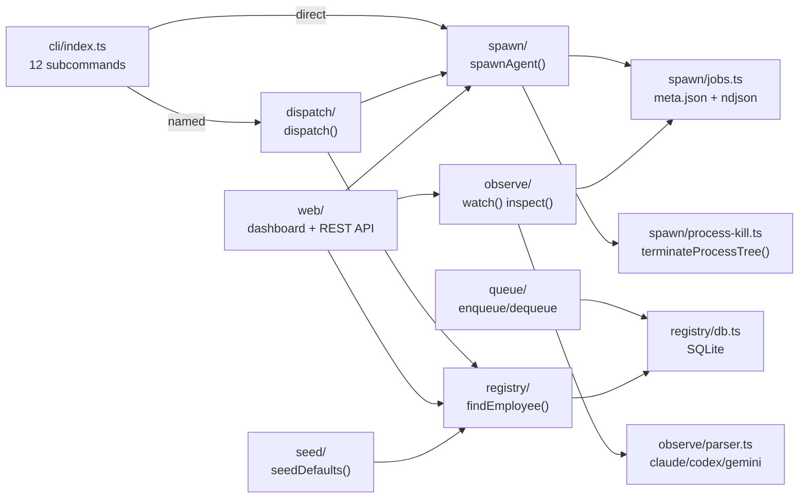
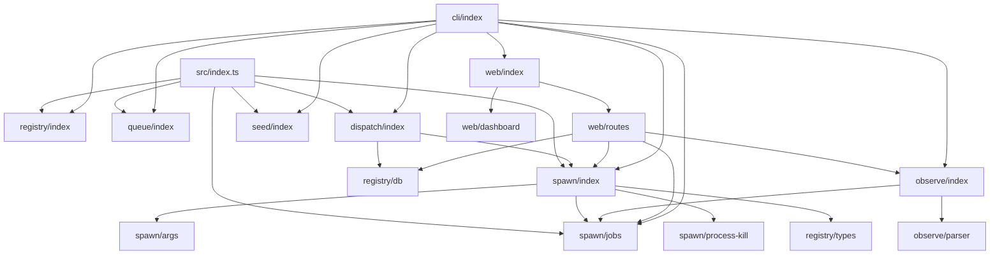

# OME Architecture Reference

> Orchestrated Multi-agent Engine — AI CLI(Claude, Codex, Gemini 등)를 직원처럼 호출·관리하는 독립 CLI + 라이브러리.

---

## 시스템 개요



## 모듈 구조

```
src/                          1,651 lines total
├── cli/index.ts         341  CLI entry: 12 subcommands (spawn, dispatch, registry, queue, jobs, kill, result, watch, inspect, web, init, status)
├── spawn/               442  Core spawning + job lifecycle
│   ├── index.ts         203  spawnAgent(), killJob(), killAllJobs()
│   ├── jobs.ts          141  Job persistence: meta.json + ndjson log + readJobLogFrom()
│   ├── process-kill.ts   60  Cross-platform process tree kill (detached + group)
│   └── args.ts           38  CLI-specific argument builders
├── registry/            208  Employee management + SQLite
│   ├── db.ts            123  Schema, CRUD, quota, busy_timeout
│   ├── types.ts          83  Employee, SpawnResult, Job, AgentCli types
│   └── index.ts           2  Re-exports
├── observe/             223  Real-time process tracking
│   ├── index.ts         103  watch() with byte-offset streaming, inspect()
│   ├── parser.ts         96  NDJSON parser (claude/codex/gemini formats)
│   └── types.ts          24  LiveRunState, ParsedToolCall
├── web/                 307  Management dashboard + REST API
│   ├── routes.ts        136  /api/* endpoints with auth + error sanitization
│   ├── dashboard.ts     116  HTML dashboard (DOM-safe, no innerHTML)
│   └── index.ts          55  createServer(opts) with auth token
├── queue/index.ts        72  Message queue: enqueue, dequeue, hold/release
├── dispatch/index.ts     25  dispatch(name, task) → employee lookup + spawn
├── seed/index.ts         26  Default employees: claude, codex, gemini
└── index.ts               7  Public re-exports
```

---

## 읽기 순서

1. **[types.md](types.md)** — 핵심 타입 정의 (Employee, SpawnResult, Job, AgentCli)
2. **[spawn.md](spawn.md)** — 프로세스 생성, kill, job 영속화
3. **[observe.md](observe.md)** — 실시간 추적, NDJSON 파싱
4. **[web.md](web.md)** — REST API, 인증, 대시보드
5. **[commands.md](commands.md)** — CLI 12개 서브커맨드

---

## 데이터 흐름

### Spawn → Job → Observe

```
spawnAgent(prompt, opts)
  → createJob() → meta.json + empty .ndjson
  → child_process.spawn(cli, args, { detached: true })
  → stdout chunks → line parser → appendJobLog() → .ndjson
  → close event → completeJob() or cancelJob()

watch(jobId)
  → readJobLogFrom(byteOffset) → parse new lines only
  → yield ProgressEvent until status ≠ running/cancelling

inspect(jobId)
  → readJobLog() (full) → parse all → LiveRunState snapshot
```

### Dispatch → Registry → Spawn

```
dispatch("Frontend", "Fix CSS")
  → findEmployee("Frontend") → { cli: 'claude', model: 'sonnet' }
  → spawnAgent(task, { cli, model, timeout: 600_000 })
```

### Web API Auth

```
Request → createServer()
  → isLoopback? → no auth needed
  → non-loopback? → auto-generate token or use --auth-token
  → Bearer header or ?token= query param
  → handleApiRequest() → Origin check on mutations
```

---

## 보안 현황 (v0.1.1)

| 영역 | 상태 |
|------|------|
| Web API 인증 | Bearer token (non-loopback 자동 생성) |
| Origin check | mutation routes에 Host/Origin 검증 |
| Error sanitization | 500 → generic "internal error", UNIQUE → 409 |
| Process kill | detached spawn + process group kill + cancelling 상태 |
| SQLite | WAL + busy_timeout 5000ms |
| stdout/stderr | 10MB / 1MB cap |
| Dashboard | innerHTML 미사용, DOM creation only |

---

## 파일별 의존 관계


